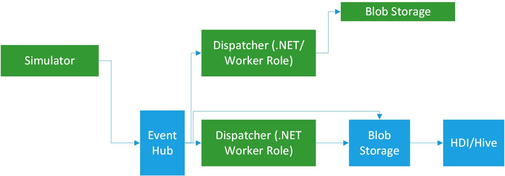

# Introduction

Building data pipelines on top of messaging solutions is a powerful approach to delivering analytics and data processing applications at cloud scale.  This guidance project is an evolving reference implementation, intended to act as a starting point for leveraging various Azure services for building out data processing pipelines.

The written guidance is intended to illustrate the set of decisions that shaped the implementation, along with the associated tradeoffs.  Architects, senior developers, lead developers, and devops responsible for designing, building and managing solutions deployed to Microsoft Azure will benefit most from reading this guide.

## The scenario

The baseline scenario used to illustrate an end to end data pipeline is a vehicle telematics scenario, simulating a large number (target 100k) of vehicles publishing a variety of messages (events) directly onto [Event Hub][eventhubpage]. 

From there the event streams are consumed by two services; one for processing **individual** messages (working against a backing data store, such as Azure storage), and one for batching data into Azure blobs for big data style analytics.  

As seen in the diagram above, the data simulator is an **event producer**, while the cold storage and message dispatcher services are **event consumers**.  As this guidance evolves, additional producers and consumers will be added to the reference implementation (and documentation about engineering choices and tradeoffs).
 
The scale target of this guidance was to produce (and consume) event streams from 100,000 simulated vehicles, each generating on average one event every 10 seconds (6 events per minute).  

## Architectural aspects

In addition to the functional requirements outlined in the previous section, the guidance also addresses key architectural aspects and decisions associated with building a cloud service (especially a high-volume data pipeline application).  Each set of decisions made in the reference implementation balance these aspects, with the decision points and tradeoffs discussed in more detail in the sections specific to the various components.

- *Scalability* is the ability to add additional capacity to a service to handle increases in load and demand, together with efficient and effective use of any resources the service uses.
- *Availability* is the ability of a service to continue to provide value in the face of transient and enduring faults in the service and in any underlying service dependencies.
- *Manageability* is the ability to understand the health and performance of the live system and manage site operations on that system.
- *Composability* is the ability to extend the system by easily adding support for new capabilities such as handling new serialization types or interfacing with new external systems.
- *Feasability* is the ability to deliver and maintain the system, on time and within budget while meeting the other requirements.  One of the guiding principles for the reference implementation has been to carefully balance functionality and robustness against complexity and concept count (overlay complicated code bases presenting challenges to maintenance and extension). 

> Note: The code has been written with a focus on being a legible starting point for implementing data pipelines in your own applications, rather than a complete "product". You should not treat the code as production-ready because it does not cover all the possible edge cases: comments in the code highlight specific areas where further effort is required to customize it to your business scenario and requirements. 

[eventhubpage]: EventHubService.md
