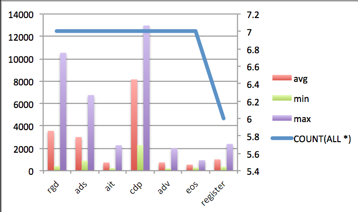
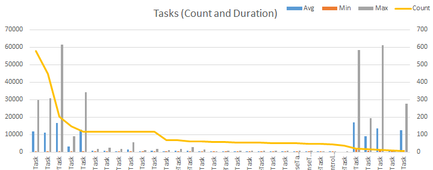

# Tackling Challenges with Data Pipeline Guidance

Over the past couple of years in AzureCAT, we've had the opportunity to work on a number of challenging systems at scale, many of which have heavily leveraged messaging systems (Azure Queues, Service Bus and now Event Hubs, as well as a variety of OSS platforms such as Rabbit and ActiveMQ).  Under conditions of extreme success, we've recognized and tackled a number of challenges related to system scalability, availability (stability) and manageability, which have been codified (pun intended) in the data pipeline guidance.

The sections below walk through each of the patterns and/or challenges we are tackling (or will tackle in future iterations) of the data pipeline guidance, along with some examples of the fascinating things that happen in production systems at scale.

Big thanks to [TODO] for rightfully calling out we forgot to put this explanation in the guidance before we published it :)

## Asynchronous batch-centric processing

Messaging centric systems are inherently I/O bound (as opposed to compute intensive systems that simply happen to use some messaging for coordination), and require careful asynchronous processing and use of batching to achieve maximum *density* (that being how much work can be successfully completed over a time period for a given resource, such as a VM).

Let's explore increasing levels of sophistication for implementing asynchronous processing on top of a messaging queue as a way of illustrating the journey and the choices/tradeoffs available.  For a discussion series on this journey with Azure Queues, please see [TODO] on Azure Friday.

For clarity, during this section we'll start by using the basic Azure Queue APIs; these APIs do not inherently implement some of the advanced features in the Event Hub or Service Bus Topic APIs such as *prefetch* (which does a lot of the asynchronous fetching of data behind the scenes - great for running code, not great for explaining a pattern :).

We'll then transition to the Event Hub APIs (which are inherently batch centric) and the higher order Event Processor Host that handles partition mapping and instance failover (for virtually all production systems, you should use the Event Processor Host).

### Basic synchronous processing

The default (and code available in most samples) is a simple receiver loop:

````C#
public void Run()
{
	var queueClient = account.CreateCloudQueueClient();
    _queue = queueClient.GetQueueReference(queueName);

    if (_queue.CreateIfNotExists())
    {
    	Trace.WriteLine("Created queue " + queueName);
    }
            
    while (true)
    {
    	var msg = _queue.GetMessage();
       if (msg != null)
       {
       		var msgContent = msg.AsString;
       		
           // Process some stuff
           Thread.Sleep(1000);
           
           _queue.DeleteMessage(msg);
       }
	}
}
````

While perfectly *functionally* correct this code is not very efficient:

- While messages are being retrieved from the queue, no messages are being processed.  
- Whether we get one message or N messages (up to a reasonable batch size) the cost of a network traversal is roughly the same.

It also suffers from the following limitations (which we'll address in other sections):

- Never start a task you can't gracefully stop; the while (true) {} loop cannot be signaled to complete or cancel.
- Don't mix lifecycle management code and message processing code, especially as the sophistication of both grows.

In order to maximize throughput and processing efficiency, we need to be asynchronously fetching small batches of data from the queue.

### Basic batching / asynchronous processing

Stepping the sophistication of the code up a bit, we have a basic iterative batch receiver loop.  This is more efficient in that it does not stall the thread while waiting for more messages, and retrieves a batch of messages with each network call.

````C#
public async Task RunAsync(CloudStorageAccount account, 
    string queueName, CancellationToken token)
{
    var queueClient = account.CreateCloudQueueClient();
    var _queue = queueClient.GetQueueReference(queueName);

    if (await _queue.CreateIfNotExistsAsync())            
        Trace.WriteLine("Created queue " + queueName);
            
    while (!token.IsCancellationRequested)
    {
        var msgs = await _queue.GetMessagesAsync(32, token);
        if (msgs != null)
        {
            foreach (var m in msgs)
            {
                var msgContent = m.AsString;

                // Process some stuff
                await Task.Delay(TimeSpan.FromSeconds(1)); 

                await _queue.DeleteMessageAsync(m, token);
            }                   
        }
    }
}
````

While far more efficient, this code still suffers from:

- The lack of *prefetch* which minimizes wait time for processing at the expense of being *greedy* in terms of message lock (as well as the blend of message lifecycle management and processing code).
- Messaging processing is sequential; even though we grab a batch of messages, we process them one after the other.  We'll tackle this challenge in the Concurrency Bounding [TODO] section.

### Asynchronous processing with Event Hub APIs

Outside of very specialized scenarios (e.g. writing a stream processor that needs to go "back in time" on a fine grained basis after an instance crash), you should always be using the Event Processor Host APIs.  The low level APIs are only included here for sake of completeness.  The basic batching processor looks similar to the queue example above, and suffers from the same limitations regarding sequential processing (but the API does implement prefetch under the hood).

````C#
public async Task RunAsync(CancellationToken token, 
    string connectionString, string path,
    string consumerGroup, string partitionId)
{
    var ehClient = EventHubClient.CreateFromConnectionString(connectionString, path);
    var consumer = ehClient.GetConsumerGroup(consumerGroup);
    var recv = await consumer.CreateReceiverAsync(partitionId);

    while (!token.IsCancellationRequested)
    {
        var msgs = await recv.ReceiveAsync(32, TimeSpan.FromSeconds(1));
        if (msgs != null)
        {
            foreach (var m in msgs)
            {
                var content = m.GetBytes();

                // Process the message
                await Task.Delay(TimeSpan.FromSeconds(1));
            }
        }
    }
}
````

### Asynchronous processing with Event Processor Host

The Event Processor Host is a great abstraction, hiding the details of partition mapping and instance affinity, and providing a streamlined method of indicating *advancement* in the stream. As opposed to standard message queues, you do not acknowledge processing of individual messages in ring buffer based systems such as Event Hub or Kafka, but instead mark progress by advancing to a given offset.

````C#
public async Task ProcessEventsAsync(PartitionContext context, 
    IEnumerable<EventData> messages)
{
    foreach (var m in messages)
    {
        var content = m.GetBytes();
        await Task.Delay(TimeSpan.FromSeconds(1));
    }

    await context.CheckpointAsync();
}
````

The hallmark of a good abstraction layer - less code, and no awkward posturing to create the right function signatures.  Great news - just use the Event Processor Host, and you don't have to worry about writing a message retrieve/dispatch loop.  Somewhat good news - there's still a lot of issues you need to worry about in production grade systems, covered in the sections below.
 
## Message Processing with Bounded concurrency

In the prior section, all of the message processing was sequential.  For compute-intensive tasks this is fine, but message processing tasks in data pipelines are working with multiple backing stores, and are inherently also I/O bound.  For this reason we want to be able to have concurrent processing of incoming messages (but not too much concurrency :).  Let's walk through several iterations of implementing concurrent processing and their pros/cons.

### Basic Concurrency via Tasks

For most applications, all modern (.NET 4.5 and above) applications should be using the Task Parallel Library and the async/await pattern (there are some low-level performance related exceptions).  Let's start by using the TPL to execute all of the messages in an incoming batch in parallel.

````C#
public async Task ProcessEventsAsyncConcurrent(PartitionContext context,
    IEnumerable<EventData> messages)
{
    var tasks = new List<Task>();

    // We'll look at creating / mapping dispatch functions for message
    // types in the next section.  For now we'll use a version of the 
    // await task delay as a pluggable function
    Func<byte[], IDictionary<string, string>, Task> procFunc =
        async (payload, props) => await Task.Delay(TimeSpan.FromSeconds(5));

    foreach (var m in messages)
    {
        var content = m.GetBytes();
        var props = m.Properties.ToDictionary(e => e.Key, e => e.Value.ToString());

        tasks.Add( procFunc(content, props));
    }

    // Wait for all of the tasks to complete
    await Task.WhenAll(tasks);

    await context.CheckpointAsync();
}
````

This is a reasonable improvement from the prior sequential processing, but still presents a few challenges:

- There's no per-message error handling (we'll tackle this a few sections down.  For now, let's pretend we never ever get bad messages or make mistakes in handling functions.
- If we receive a very large batch of messages (which is quite possible in event hub) we can overwhelm any downstream systems that are touched by the message handlers, triggering a cascading failure.

In order to handle this burst event we also need to bound concurrency at the processing level.

### Bounding Concurrency with TPL Data and/or PLINQ

There are two "simple" ways of handling this bounded concurrency / scheduling challenge in .NET; with TPL DataFlow and the ActionBlock<T>, or with PLINQ and Parallel.For.  Both are good approaches, but we happen to prefer the use of the DataFlow blocks for building *asynchronous* continuous pipelines and used it in the guidance (Parallel.ForEach does currently like async/await very much). 

The action block takes incoming messages and executes a given lambda expression with concurrency bounded by its configuration.  First, we'll create an action block that takes EventData messages an executes a handler, configured for a maximum degree of concurrency.

Then we'll iterate through the list of messages and Post (TODO) each into the worker block.  Note that the worker block can fill it (it has a constrained length internal queue); if we want to handle that condition we'd either (a) set the internal queue size to be larger than the maximum possible incoming message batch, or use the _await SendAsync(msg)_ method instead.

````C#
public async Task ProcessEventsAsyncBoundedConcurrentPLINQ(PartitionContext context,
    IEnumerable<EventData> messages, int maxConcurrency)
{
    var tasks = new List<Task>();

    // We'll look at creating / mapping dispatch functions for message
    // types in the next section.  For now we'll use a version of the 
    // await task delay as a pluggable function
    Func<byte[], IDictionary<string, string>, Task> procFunc =
        async (payload, props) => await Task.Delay(TimeSpan.FromSeconds(5));

    var workerBlock = new ActionBlock<EventData>(async msg =>
    {
        var content = msg.GetBytes();
        var props = msg.Properties.ToDictionary(e => e.Key, e => e.Value.ToString());
        await procFunc(content, props);

    }, new ExecutionDataflowBlockOptions()
    {
        MaxDegreeOfParallelism = maxConcurrency
    });

    // Post each message into the action block.  NOte; we don't yet handle the
    // worker block is full condition (to handle that we'd await workerBlock.SendAsync(m))
    foreach (var m in messages)
        workerBlock.Post(m);

    // Wait for all messages to be processed before checkpoint
    workerBlock.Complete();
    await workerBlock.Completion;
             
    await context.CheckpointAsync();
}
````

Without any of the error handling or custom dispatch functions included, this is essentially the pattern we used in the data pipeline guidance for providing constrained concurrency.

## Payload identification and workflow association / routing

Now that we've tackled asynchronous batch processing and managing concurrency, let's start filling int the blanks on associating logic with each message based on message payload and context (properties) in an efficient way.

Generally what we'll look to do is examine the properties of the message (without cracking the payload) if possible, through shared conventions with the sender(s).  The approach we took in the guidance was that the senders would adhere to the convention of adding the property keys *MessageType* and *DeviceId*.  From there, we can look at the *MessageType* value, and associate the message with an appropriate handler by using the *IMessageHandler* interface.

````C#
// The message stream can only be read once, extract the body up front
content = msg.GetBytes();

// if only some properties are used in the happy path but all are needed in some cases.
props = msg.Properties.ToDictionary(
	k => k.Key,
	v => v.Value.ToString());

// Promote standard EventHub properties into the property collection (for logging)
var msgId = String.Concat(_eventHubName, "/", msg.PartitionKey, "/", msg.Offset);
props.Add(Constants.ID, msgId);
props.Add(Constants.MSG_OFFSET, msg.Offset);
props.Add(Constants.PARTITION, msg.PartitionKey);

// Look up the message type handler, using the payload and 
// associated properties
var handler = _handlerResolver.GetHandler(props, msgId);
handlerName = handler.Name;
````

The implementation of the handler resolver can be approached in a number of different ways.  We chose to implement handlers and annotate them with an attribute.  Other approaches include being convention driven (similar to how WebAPI controllers are mapped, leveraging IoC containers, etc).  The key to performance is storing the handler map in a very efficient data structure for highly contended reads.  

The reason the data structure needs to optimize for high read contention on a small number of handler types is the typical power law distribution seen in most event processing pipelines (i.e. there is typically a small set of messages such as heartbeats or location updates that are sent continuously).  For example, the graph below shows the distribution from a customer project AzureCAT had worked on that had a very high number of _Type A_ messages being sent through the system.

TODO - graph from customer

Storing this handler map in a standard .NET dictionary will create high contention and backpressure during read operations in conditions of *extreme success* (i.e. when every other part of the system is optimized).  To avoid this, store the map in a concurrency-friendly data structure such a ConcurrentDictionary, or even better an ImmutableDictionary (as the handler map will generally not be changing dynamically).  

The method resolver in the data pipeline guidance uses an ImmutableDictionary to store the handler map (as seen in the code below, it first generates a standard dictionary, then converts to an immutable dictionary for access).

````C#
private void InitializeDispatchTable(IEnumerable<Type> types)
{
    // Create a temporary holding dictionary for the type->instance map
    var handlers = new Dictionary<MessageRegistration, IMessageHandler>();

    var filteredTypes = types.Where(t => typeof(IMessageHandler).IsAssignableFrom(t));

    // Iterate through the types and generate a type->instance of type
    // map
    foreach (var type in filteredTypes)
    {
        // Each handler may be registered to multiple types
        var registrations = type.GetCustomAttributes(
            typeof(MessageHandlerAttribute), true);

        foreach (MessageHandlerAttribute registration in registrations)
        {
           // SNIP
           // Add to the set of handlers
           handlers.Add(key, handler);
        }
    }

    // Convert the temporary map into an immutable dictionary for
    // performance in concurrent applications
    Logger.Debug("Registering {0} handlers", handlers.Keys.Count);
    this._dispatchTable = handlers.ToImmutableDictionary();
}
````
## Per-message instrumentation and logging

In order to understand, quantify and optimize performance, monitoring, diagnostics in a message-driven dispatch system, granular telemetry on a per-message basis is necessary.  There are a number of questions that need to be asked and answered during operations:

- [Monitoring] How many messages are being processed?  How many messages are not processed?  If no messages are being processed, is it because there is no work to do, or because processing has stopped?
- [Performance] How long do individual messages take to process, and what is their result (success, threw error, timed out)? How long does each message type or category take to process (latency), average, min, max and standard deviation (are there highly inconsistent processing times indicative of contention)?  
- [Diagnostics] For a given incoming message, which components have touched the message, what did they do, what happened, what went wrong?

All of this starts from granular logging in the dispatcher of each message's execution time, context and result (errors), along with carrying a message or activity identifier through processing.  Let's start by looking at an approach to logging execution time (this uses the CSF ILogger TODO, and we'll port this over to using SLAB in the near future, but that's a configuration change, and won't code ripple).

````C#
protected async Task ProcessMessageWrapper(Guid activityId,
    byte[] content, IDictionary<string, string> properties)
{
    var sw = Stopwatch.StartNew();
    Exception ex = null;

    // Look up the message type handler, using the payload and 
    // associated properties
    var handler = _handlerResolver.GetHandler(props, msgId);
    handlerName = handler.Name;

    try
    {               
        await handler.ExecuteAsync(activityId, content, properties);
    }
    catch (Exception ex0)
    {
        Logger.Error(activityId, ex0, "Could not process message {0}", activityId);
        ex = ex0;
    }
    finally
    {
        sw.Stop();
        Logger.TraceApi(activityId, handlerName, sw.Elapsed);
    }

    // TODO; if an exception was thrown we need to handle a potentially poison
    // message
} 

````

The output of this logging activity creates an API log similar to the one shown below.

````
time,machinename,role,instance,api,elapsed,eventid,action,message
2015-01-14 06:12:32.9084,MASDEV,Foo.Master,Master_IN_0,register,00:00:00.3487078,a51826c1-ee34-49e9-91c4-d9109c441d34,EXEC,Dispatcher
2015-01-14 06:15:02.0533,MASDEV,Foo.Master,Master_IN_0,rgd,00:00:03.4657314,1b630977-48fd-4f65-a64d-020fedd1d999,EXEC,FooProcessor
2015-01-14 06:15:08.8143,MASDEV,Foo.Master,Master_IN_0,ads,00:00:06.7523178,1078e194-0a36-41bb-a81d-d5a73732104f,EXEC,FooProcessor
2015-01-14 06:15:09.2113,MASDEV,Foo.Master,Master_IN_0,ait,00:00:00.3973700,29ff97e9-2790-44d5-adad-ee526cbde6f0,EXEC,FooProcessor
2015-01-14 06:15:19.0539,MASDEV,Foo.Master,Master_IN_0,cdp,00:00:09.8383361,b60173b1-ffdb-4a0f-8dc3-99589a60442d,EXEC,FooProcessor
2015-01-14 06:15:19.3076,MASDEV,Foo.Master,Master_IN_0,adv,00:00:00.2506695,e56fe72b-171a-47d5-a391-359347b8a830,EXEC,FooProcessor
2015-01-14 06:15:19.6956,MASDEV,Foo.Master,Master_IN_0,eos,00:00:00.3865102,ed0128be-0b87-4842-8d65-3444a4059bb2,EXEC,FooProcessor
````

Through the use of Log Parser or a similar tool we can then crunch this data to produce charts for various purposes.  For example, here is a query and a chart that is very useful in performance optimization that does a teardown by message handler type and evaluates the min/max/avg latency of execution against the number of times the message is called.

````sql
SELECT 
    api, 
    COUNT(*), 
    AVG(milliseconds) AS avg, 
    MIN(milliseconds) AS min, 
    MAX(milliseconds) AS max
USING ADD(MUL(TO_REAL(EXTRACT_TOKEN(elapsed, 1, ':')), 60000), 
     MUL(TO_REAL(EXTRACT_TOKEN(elapsed, 2, ':')), 1000)) as milliseconds 
FROM '[LOGFILEPATH]'
GROUP BY api
````

api	| COUNT(ALL *)	| avg | min |	max
--- | ------------- | --- | --- | ---
adv	| 7	| 737.24 |	203.15 |	1996.93
ait	| 7	| 731.16 |	229.18 |	2273.53
cdp	| 7	| 8154.69 |	2291.55 |	12970.99
eos	| 7	| 540.82 |	286.07 |	936.82
register |	6 |	1007.64 |	348.71 |	2392.56
rgd	| 7	| 3558.59 |	420.08 |	10529.38
ads	| 7	| 3006.04 |	896.39 |	6752.32

By charting this data the key candidates for message optimization jump out.  In this case if we were to do any performance optimization (i.e. if message processing times were not within acceptable ranges for our business metrics) we would likely start by optimizing the CDP message type.



Another example from a CAT engagement shows the power-law distribution typical in telematics systems.  In the case below we would start by optimizing the variable and/or slow messages types called the most often (those on the left) and ignore those on the right.



For a relatively small logging investment in the core dispatcher we can derive very powerful insight into the flow, latency and performance of our message processing (note; in any bounded concurrency system latency == throughput, so optimizing latency results in more throughput). 

## Error handling and bad actor identification (slow processing)

Thus far we've looked at what happens when everything works perfectly.  This not being how the world works during conditions of extreme success, let's review the most common error conditions for message processing and how to handle them appropriately.

### Individual message is not recognized / no registered handler

One common scenario in telematics or IoT data processing scenarios is an unrecognized message, typically as a result of a misconfigured header, a firmware mismatch, or a missing handler (firmware updated, handlers not updated).  

When implementing a message handler lookup function, it is critical to include a default message handler that posts the content and context to a remote *poison message store* for further inspection and reprocessing if appropriate.

````C#
// SNIP
_handler = (IPoisonMessageHandler)resolver.GetService(typeof(IPoisonMessageHandler));
// SNIP
public async Task ExecuteAsync(
    ProcessingContext context,
    byte[] payload,
    IDictionary<string, string> properties)
{
    var headers = properties
        .Select(p => string.Format("{0}:{1}\n", p.Key, p.Value))
        .ToArray();
        
    Logger.Warning(
        "No handler was found for {0}. The event contained the following properties:\n {1}",
        context,
        string.Join(Environment.NewLine, headers));

    await _handler
        .PublishAsync(FailureMode.UnknownPayload, context, payload, properties)
        .ConfigureAwait(false);
}
````

For more details on implementing a poison handler see the TODO section below.

### Individual message processing throws an exception

The most common error condition is that an individual message fails to process for any number of reasons (invalid code, unavailable downstream services, invalid message).  In this case we need to catch any exceptions arising from the individual message and publish those to an appropriate external store (poison message "queue") for later review.  Some issues are related to network or downstream service transients, while others expose functional bugs in your message handling logic.

````C#

````


### Individual message processing stalls the pipeline

## Poison message handling

## State and concurrency management 
## Consistency and idempotency
